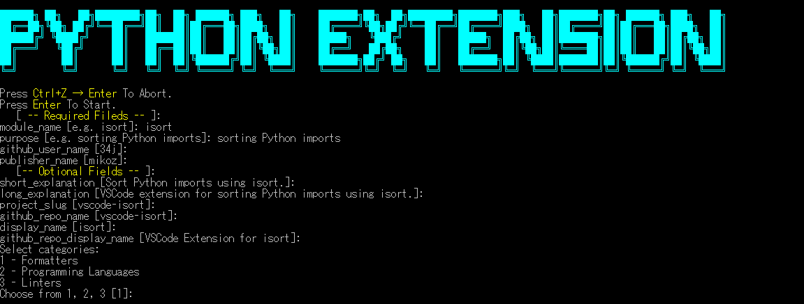
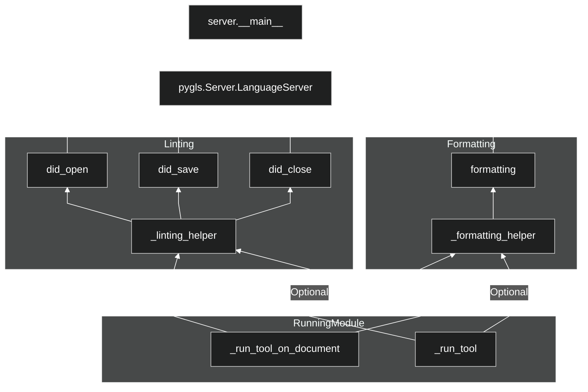

# Cookiecutter VSCode Python Tools Extensions

Cookiecutter for a VS Code extension for your favorite python tool. Linter, Formatter, or Code Analysis, or all of those together.



## Requirements

1. VS Code 1.64.0 or greater
1. Python 3.7 or greater
1. node >= 14.19.0
1. npm >= 8.3.0 (`npm` is installed with node, check npm version, use `npm install -g npm@8.3.0` to update)
1. Python extension for VS Code

You should know to create and work with python virtual environments.

## Installation

```shell
py -m venv venv
"venv/scripts/activate"
pip install -U cookiecutter jinja2-strcase
git clone https://github.com/34j/vscode-python-tools-extension-template-cookiecutter.git
cookiecutter ./vscode-python-tools-extension-template-cookiecutter
```

Once you have installed,

```shell
"venv/scripts/activate"
cookiecutter ./vscode-python-tools-extension-template-cookiecutter
```

## Getting Started

Create `./.venv` and install libraries using `Makefile`.

```shell
make init
```

## Features

- [VSCode extension](https://code.visualstudio.com/api) runs Python scripts.
- Python interpreter is the result of command `python.interpreterPath` by default, `{{cookiecutter.ext_name}}.interpreter` if specified
- Python runs Python scripts in `bundled/tool` on start or on command `{{cookiecutter.ext_name}}.restart` is called.
- Python scripts uses [pygls](https://pygls.readthedocs.io/) to create a [language server protocol](https://microsoft.github.io/language-server-protocol/specifications/lsp/3.17/specification/). Since pygls is poorly documented, see [Language Server Protocol Specification](https://microsoft.github.io/language-server-protocol/specifications/lsp/3.17/specification/) for details.
- Python scripts has following dependencies.



If `{{cookiecutter.module_name}}` supports programmatic apis, you can completely delete `_run_tool_on_document()`, `_run_tool()` and other related settings, and directly modify `_linting_helper()`, `_formatting_helper()`. Otherwise, you have to modify `argv` everywhere.

<!--
  - server.py creates `pygls.Server.LanguageServer`
  - `pygls.Server.LanguageServer` <- `@LSP_SERVER.feature(lsp.---)``did_open(), did_save(), did_close()`, `formatting()`.
  - `did_open(), did_save(), did_close()` <- `_linting_helper()`, `formatting()`, <- `_formatting_helper()`
  - `_linting_helper()`, `_formatting_helper()` <- `_run_tool_on_document()`, (optionally  `_run_tool()`), but 
-->

As a VSCode extension, by default the following features will be added.

- A command `{{cookiecutter.display_name}}: Restart Server` (command Id: `{{cookiecutter.ext_name}}.restart`).
- Following setting:

|Name|Description|
|----|-----------|
|`{{cookiecutter.ext_name}}.logLevel`| The log level the extension logs at, defaults to 'error'.|
| `{{cookiecutter.ext_name}}.args`| Additional arguments passed in. Each argument is a separate item in the array.|
| `{{cookiecutter.ext_name}}.path`| When set to a path to {{cookiecutter.module_name}} binary, extension will use that. NOTE: Using this option may slowdown server response time.|
| `{{cookiecutter.ext_name}}.importStrategy`| Defines where `{{cookiecutter.module_name}}` is imported from. This setting may be ignored if `{{cookiecutter.ext_name}}.path` is set.|
| `{{cookiecutter.ext_name}}.interpreter`| When set to a path to python executable, extension will use that to launch the server and any subprocess.|
| `{{cookiecutter.ext_name}}.showNotification`| Controls when notifications are shown by this extension.|

- Following triggers for extension activation:
  - On Language `python`.
  - On File with `.py` extension found in the opened workspace.
  - On Command `{{cookiecutter.ext_name}}.restart`.
- Output Channel for logging `Output` > `{{cookiecutter.display_name}}`

## Adding features from your tool

Open `bundled/tool/server.py`, here is where you will do most of the changes. Look for `TODO` comments there for more details.

Also look for `TODO` in other locations in the entire template:

- `bundled/tool/runner.py` : You may need to update this in some special cases.
- `src/test/python_tests/test_server.py` : This is where you will write tests. There are two incomplete examples provided there to get you started.
- All the markdown files in this template have some `TODO` items, be sure to check them out as well. That includes updating the LICENSE file, even if you want to keep it MIT License.

References, to other extension created by our team using the template:

- Protocol reference: <https://microsoft.github.io/language-server-protocol/specifications/specification-3-16/>
- Implementation showing how to handle Linting on file `open`, `save`, and `close`. [Pylint](https://github.com/microsoft/vscode-pylint/blob/main/bundled/tool/server.py)
- Implementation showing how to handle Formatting. [Black Formatter](https://github.com/microsoft/vscode-black-formatter/blob/main/bundled/tool/server.py)
- Implementation showing how to handle Code Actions. [isort](https://github.com/microsoft/vscode-isort/blob/main/bundled/tool/server.py)

## Building and Run the extension

Press `F5`.

## Debugging

Press `F5`.

## Adding new Settings or Commands

You can add new settings by adding details for the settings in `package.json` file. To pass this configuration to your python tool server (i.e, `server.py`) update the `settings.ts` as need. There are examples of different types of settings in that file that you can base your new settings on.

You can follow how `restart` command is implemented in `package.json` and `extension.ts` for how to add commands. You cam also contribute commands from Python via the Language Server Protocol.

## Testing

```shell
make test
```

## Linting

```shell
make lint
```

## Packaging and Publishing

```shell
make publish
```

## Programming Languages and Frameworks

The extension template has two parts, the extension part and language server part. The extension part is written in TypeScript, and language server part is written in Python over the `pygls` (Python language server) library.

For the most part you will be working on the python part of the code when using this template. You will be integrating your tool with the extension part using the [Language Server Protocol](https://microsoft.github.io/language-server-protocol). `pygls` currently works on the [version 3.16 of LSP](https://microsoft.github.io/language-server-protocol/specifications/specification-3-16/).

The TypeScript part handles working with VS Code and its UI. The extension template comes with few settings pre configured that can be used by your tool. If you need to add new settings to support your tool, you will have to work with a bit of TypeScript. The extension has examples for few settings that you can follow. You can also look at extensions developed by our team for some of the popular tools as reference.
